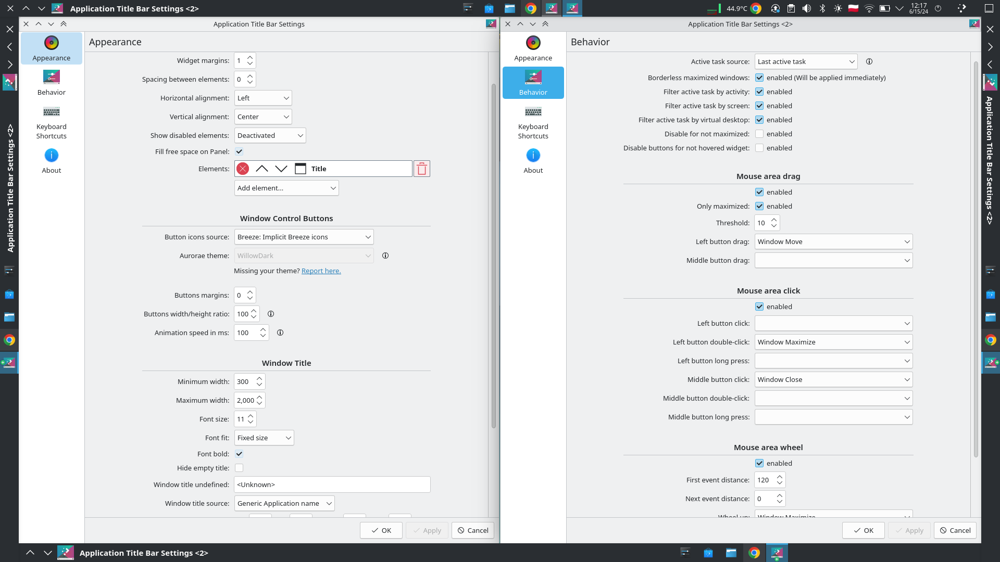

# Application Title Bar

[](https://opensource.org/licenses/)


## Description

KDE plasmoid compatible with Qt6 with window title and buttons.
I like minimalistic display layout and used Active Window Control plasmoid, but it's abandoned for several years and now incompatible with Plasma6.
So, I decided to create my own widget with the minimal set of features.



### Goal

Stable and fast widget with control buttons and window title, ideally with the same functionality as Unity panel.
I would like to keep the widget pure QML to avoid incompatibility and maintenance issues.

Disadvantages of pure QML widget:
* Only icons can be used from Aurorae themes, the rest is ignored. Binary themes are unsupported at all (Issues [#18](https://github.com/antroids/application-title-bar/issues/18), [#6](https://github.com/antroids/application-title-bar/issues/6)).
* I cannot see the way to build menu with current plasmoid API (Issue [#13](https://github.com/antroids/application-title-bar/issues/13))

### Features

* Close, minimize, maximize, keep below/above buttons.
* Title with app name.
* Configure actions on mouse events.
* Configurable elements set and order.
* Different theming options. Internal Breeze icons, System icons and Aurorae theme.
* Configurable layout and geometry.
* Click and drag widget to reposition window (as if you'd dragged the window's integrated title bar)

## Installing

1. Bash script
    - Update: `wget https://github.com/antroids/application-title-bar/releases/latest/download/application-title-bar.plasmoid -O ${TMPDIR:-/tmp}/application-title-bar.plasmoid && kpackagetool6 -t Plasma/Applet -u ${TMPDIR:-/tmp}/application-title-bar.plasmoid && systemctl --user restart plasma-plasmashell.service`

    - Install `wget https://github.com/antroids/application-title-bar/releases/latest/download/application-title-bar.plasmoid -O ${TMPDIR:-/tmp}/application-title-bar.plasmoid && kpackagetool6 -t Plasma/Applet -i ${TMPDIR:-/tmp}/application-title-bar.plasmoid && systemctl --user restart plasma-plasmashell.service`

2. Manual with Plasma UI
    - Install via "Add Widgets..." -> "Get New Widgets..." -> "Download..."
    - Install from [KDE Store](https://store.kde.org/p/2135509)
    - Download Latest \*.plasmoid from [Releases page](https://github.com/antroids/application-title-bar/releases) and install it via "Add Widgets..." -> "Get New Widgets..." -> "Install Widget From Local file"

3. Nix (needs Nixpkgs unstable 24.11 or later)

    On NixOS:
    ```nix
    environment.systemPackages = with pkgs; [
        application-title-bar
    ];
    ```
   Other distros:
   ```
   # without flakes:
   nix-env -iA nixpkgs.application-title-bar
   # with flakes:
   nix profile install nixpkgs#application-title-bar
   ```
### Additional packages

- Debian, Ubuntu, Kali Linux, Raspbian: `apt-get install qdbus`
- Alpine: `apk add qt5-qttools`
- Arch Linux: `pacman -S qdbus-qt5`
- CentOS: `yum install qdbus-qt5`
- Fedora: `dnf install qt5-qttools`

## 🆘 In cases of panel freezes or crashes 🆘

Although the widget is being used by me and a lot of other people, there is still a chance that it would be incompatible with your OS distribution. The worst that can happen is some Binding loop that can freeze your Plasma panel.

In such cases you can use the following script to downgrade the panel version:
`
wget https://github.com/antroids/application-title-bar/releases/download/v0.6.8/application-title-bar.plasmoid -O ${TMPDIR:-/tmp}/application-title-bar.plasmoid && kpackagetool6 -t Plasma/Applet -u ${TMPDIR:-/tmp}/application-title-bar.plasmoid && systemctl --user restart plasma-plasmashell.service
`

Or you can remove the widget: `kpackagetool6 --type Plasma/Applet --remove com.github.antroids.application-title-bar`

Please, don't forget to fill the report about the issues.

## License

This project is licensed under the GPL-3.0-or-later License - see the LICENSE.md file for details

## Contributing

Pull requests and Issue reports are always welcome.
